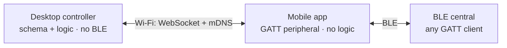

# LogicGATT v2

LogicGATT emulates a real BLE peripheral. Instead of building or flashing hardware, a device's
GATT schema and runtime behavior are defined on the desktop and served from a phone's Bluetooth
radio — so any BLE central (an app, a product, a debugging tool) discovers and talks to it as if
it were the real device.

Typical uses:

- **Reproducing an existing BLE device** — a sensor, a wearable, a product — to build or test
  the app or central that talks to it, without the physical hardware.
- **Prototyping a new peripheral** — designing its services and protocol and iterating on
  behavior live, before any firmware exists.
- **Modeling advanced, stateful behavior** — responses computed from the bytes written,
  notifications on a timer, multi-step control-point protocols — in sandboxed JavaScript.

Rewrite of [LogicGATT](https://github.com/Dishuk/logic-gatt) (a single-machine web app) as
two native apps connected over local Wi-Fi.

## How it works

The work is split across two apps:

- **Desktop controller** (`logic-gatt-desktop-app/`) — an Electrobun/Bun app. Holds
  everything: the GATT schema editor, the scenario/function engine, and a sandboxed
  JavaScript runtime. It does **no BLE**.
- **Mobile app** (`logic-gatt-mobile-app/`) — an Expo app that is the BLE **peripheral**
  (GATT server). A stateless relay: it advertises the schema, executes native GATT calls,
  and forwards BLE events. It holds no logic.

The two run on the same Wi-Fi network. The desktop runs a WebSocket server and advertises
over mDNS; the phone discovers it (mDNS or a QR code) and connects.



Both links are bidirectional: the desktop sends commands and the phone sends events back;
the central reads/writes and the phone responds/notifies.

Runtime flow:

1. A GATT schema (services, characteristics, advertising) and scenario logic are authored on
   the desktop.
2. The schema is uploaded to the phone, which builds the GATT server and starts advertising.
3. A **BLE central** — any GATT client (nRF Connect, another app, a real product) — connects
   to the phone and reads or writes characteristics.
4. Each read/write is relayed to the desktop. The desktop's scenario logic runs in the
   sandbox and tells the phone how to respond or which notification to push.

All device behavior is decided on the desktop; the phone only carries it out. This mirrors
the original app, where logic ran in the browser and an ESP32/adapter was the peripheral.

## Repository structure

```
logic-gatt-v2/
├── logic-gatt-desktop-app/   # Electrobun controller (Bun): UI, schema editor, logic engine, transport modules
├── logic-gatt-mobile-app/    # Expo app: the BLE GATT peripheral (relay)
├── shared/                   # @logic-gatt/theme — shared design tokens
└── Makefile / mise.toml      # Makefile = all tasks; mise = toolchain only
```

## Development

Built from source. [mise](https://mise.jdx.dev/) provisions the toolchain (Node + Bun);
the root `Makefile` holds all build/run tasks. Manual prerequisites:

| Tool | Version | For |
|------|---------|-----|
| [Node.js](https://nodejs.org/) | LTS (>= 20) | mobile app (Expo) |
| [Bun](https://bun.sh/) | latest | desktop app (Electrobun) |

```bash
mise trust && mise install     # provision Node + Bun
make install                   # install both apps' dependencies

make dev                       # run the desktop controller
make android                   # build + run the mobile dev build on a device (or: make ios)
```

The mobile app needs a **native dev build** (`expo run:android` / `run:ios`) — BLE peripheral
support is a native module, so Expo Go cannot run it and there is no released build. Desktop
and phone must share a Wi-Fi network. In the desktop app, the **Mobile** transport starts the
server and shows a QR code; the phone connects by scanning it or via mDNS.

| Target | Description |
|--------|-------------|
| `make install` | Install desktop + mobile dependencies |
| `make dev` / `make hmr` | Desktop app (`electrobun dev --watch` / with Vite HMR) |
| `make android` / `make ios` | Build + run the mobile dev build |
| `make start` | Expo dev server (mobile) |
| `make lint` / `make typecheck` | Lint the mobile app / type-check both apps |
| `make test` | Run the desktop Vitest suite |
| `make build` | Build the desktop canary installer ZIP (`logic-gatt-desktop-app/artifacts/canary-win-x64-LogicGATT-Setup-canary.zip`) |
| `make gen-theme` | Regenerate desktop `theme.css` from shared tokens |

### Production-like builds

For a prod build instead of the dev server:

```bash
make apk      # mobile: build + install a RELEASE APK on a connected device
make build    # desktop: canary installer ZIP -> logic-gatt-desktop-app/artifacts/canary-win-x64-LogicGATT-Setup-canary.zip
make dist     # both of the above
```

The desktop deliverable is the **zip** in `artifacts/`. Unzipping it and running
`LogicGATT-Setup.exe` installs to `%LOCALAPPDATA%\com.dishuk.logicgatt.desktop\` and launches. The bare
`build/.../LogicGATT-Setup-canary.exe` is only a ~400KB extractor stub; it needs the `.installer\`
payload the zip carries, so it won't run on its own.

## Documentation

| Component | |
|-----------|--|
| Desktop controller | [logic-gatt-desktop-app/README.md](logic-gatt-desktop-app/README.md) |
| Logic constructor (schema + scenario/function engine) | [logic-gatt-desktop-app/docs/LOGIC_CONSTRUCTOR.md](logic-gatt-desktop-app/docs/LOGIC_CONSTRUCTOR.md) |
| Mobile app | [logic-gatt-mobile-app/README.md](logic-gatt-mobile-app/README.md) |
| Shared theme | [shared/README.md](shared/README.md) |

## License

MIT
